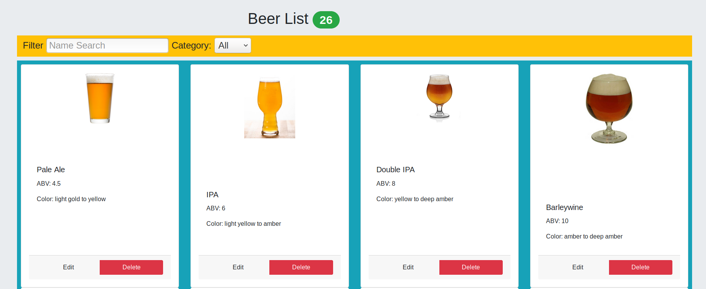
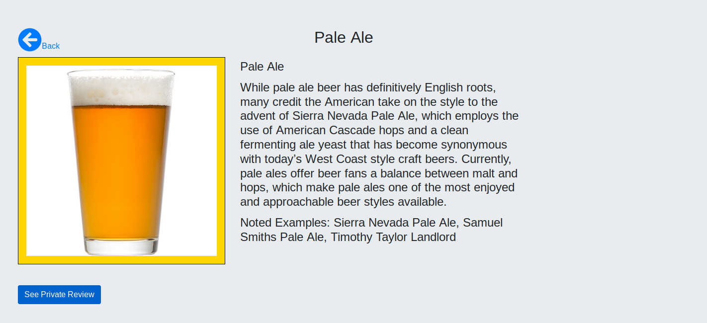
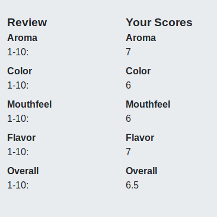
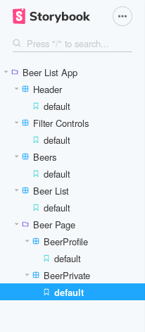

# BSc (Hons.) Level 8 - Assignment 1 - Single Page app.

Name: James Richardson

## Overview.

This app is to allow the user to view information about 26 different styles of beer, typical values related to the particular beer style, eg. ABV percentage, color, etc., and a description about the 
beer style. There is a private section where the user can enter their own review. 

- Feature 1: Homepage of list of 26 different beers with picture thumbnail and specs
- Feature 2: Filter ability
- Feature 3: Search ability
- Feature 4: Link to specific beer page with more details and description
- Feature 5: Link to private user review

## Setup.

1: Open a terminal and navigate to the base folder
2: Run command: npm install
3: Run command: npm remove csstools/normalize.css
4: Run command: npm install csstools/normalize.css
5: Run command: npm start

## Data Model Design.
___________       _____________        ______________ 
| BeerList |=====>|BeerPage    |======>|User Reviews |
|__________|      |____________|       |_____________|

The user is first brought to the Beer List of 26 different styles of beer
The user can filter the results using a name search text box, or a drop-down menu
The user can update and/or delete each beer or it's specs
The user can click on the image of the beer and be brought to the beer's page with more info
The user can enter a review of that beer which will save

~~~
src/components/filterControls.js => This is some of the code to filter the results

 handleChange = (e, type, value) => {
        e.preventDefault();
        this.props.onUserInput(type, value);
    };
    handleTextChange = e => {
        this.handleChange(e, "name", e.target.value);
    };
    handleCategoryChange = e => {
        this.handleChange(e, "category", e.target.value);
    };

src/components/beers.js => This is some of the code for editing/deleting functionality in the beer list

handleEdit = () => this.setState({ status: "edit" });
  handleSave = e => {
        e.preventDefault();
        let updatedABV = this.state.abv.trim();
        let updatedColor = this.state.color.trim();
        if (!updatedABV || !updatedColor) {
        return;
        }
        let { abv, color } = this.state;
        this.setState({ status: "", previousDetails: { abv, color } });
        api.update(this.state.previousDetails.name, updatedABV, updatedColor);
  };
  handleCancel = () => {
    let { name, picture, abv, color } = this.state.previousDetails;
    this.setState({ status: "", name, picture, abv, color });
  };
  handleABVChange = e => this.setState({ abv: e.target.value });
  handleColorChange = e => this.setState({ color: e.target.value });
  handleDelete = () =>  this.setState({ status : 'del'} );
  handleConfirm = (e) => {
    e.preventDefault();
    this.props.deleteHandler(this.state.name);
  };

src/dateStore/stubAPI => This is an example of the JSON data stored for each beer

 id: 1,
                        "category": "Ale",
                        "picture": {thumbnail: '/pictures/PaleAle.jpg'},
                        "name": "Pale Ale",
                        "abv": "ABV: 4.5",
                        "color": "Color: light gold to yellow",
                        "description": "While pale ale beer has definitively English roots, many credit the American take on the style to the advent of Sierra Nevada Pale Ale, which employs the use of American Cascade hops and a clean fermenting ale yeast that has become synonymous with today’s West Coast style craft beers. Currently, pale ales offer beer fans a balance between malt and hops, which make pale ales one of the most enjoyed and approachable beer styles available.",
                        "examples": "Sierra Nevada Pale Ale, Samuel Smiths Pale Ale, Timothy Taylor Landlord"

~~~
## UI Design.

There is a card for each beer saved in the stubAPI. Each beer can be deleted, and the abv and color can be edited. The beer image is clickable

Individual beer pages with a detailed description and noted examples of the style

The beer page with the users private review

## Routing.

- /beers (public)- displays all beer cards - name, abv, color, image.
- /beers/:id (private) - detail view of a particular beer.

## Storybook.

## Backend (Optional).

JSON-Server used as a backend for the data

## Independent learning.

I had to visit StackOverflow many times while developing the app. What I found with this assignment is that although I am using the "contactList" lab as a framework, most of the work was understanding the errors returned to the console. Once the bug-hunting was completed, the work progressed well, but there were a few errors, mostly in routing the data from the main beer list to the beer page. Once the main beer list was created, there were some css errors and bugs that needed to be fixed, W3Schools was a big help in understanding some of those, and again, StackOverflow. 

